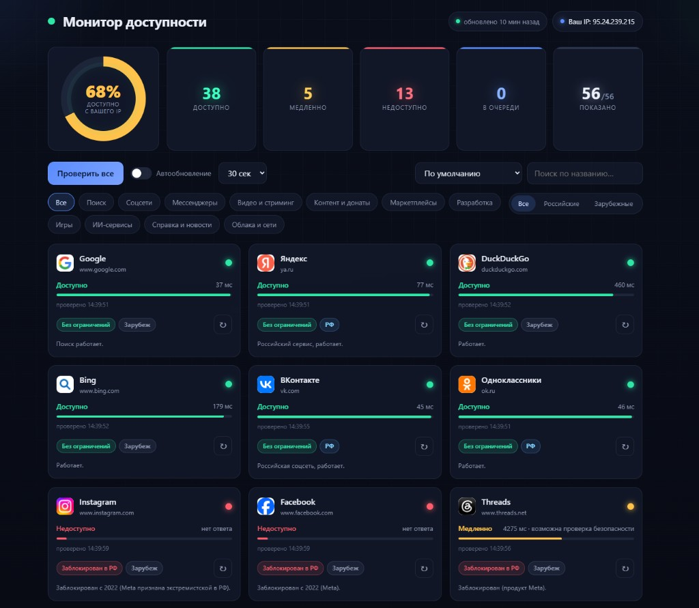

# Монитор доступности сайтов

Веб-дашборд со списком востребованных в России ресурсов и **проверкой их доступности прямо из браузера пользователя (с его IP)** в реальном времени.

Подходит для обычного хостинга: **PHP + JS**, без сборки, фреймворков и базы данных.

<p align="center">
  <a href="docs/screenshot.png">
    
  </a>
</p>

<p align="center">
  <em>Сводка по статусам, фильтры по категории и стране, живые индикаторы на каждом ресурсе.</em>
</p>

## Возможности

- **56 ресурсов** — поиск, соцсети, мессенджеры, маркетплейсы, dev-сервисы и др.
- Проверка **с IP пользователя** (включая VPN/прокси), без серверного пинга
- Статусы: доступно / медленно / недоступно / в очереди
- Кольцо **% доступности**, кликабельные плитки-фильтры по статусу
- Фильтры: категория, **российские / зарубежные**, поиск, сортировка
- Автообновление (15–120 с), определение внешнего IP
- Адаптивная вёрстка для смартфонов и планшетов

## Структура проекта

```
index.php              — главная страница (UI + передача списка в JS)
config.php             — ресурсы, категории, справочные ограничения в РФ
assets/css/style.css   — оформление (тёмный дашборд)
assets/js/app.js       — логика проверки в браузере
docs/screenshot.png    — скриншот для README
```

## Как это работает

- Список сайтов в `config.php`, PHP отдаёт его на страницу.
- `app.js` проверяет **сетевую достижимость** хоста несколькими путями: `/`, `/robots.txt`, `/favicon.ico`, при необходимости — скрытый iframe.
- Классификация по времени отклика:
  - **до 2.5 с** → доступно;
  - **2.5–8 с** → медленно;
  - **таймаут / ошибка** → недоступно.
- Редирект на капчу (Яндекс SmartCaptcha и др.) → **медленно** с подсказкой «возможна капча — сайт отвечает», не «недоступно».
- Бейдж «Заблокирован в РФ» — **справочный** (`status` в config), живой индикатор показывает доступность **с текущего IP**.

### Ограничения браузера

Из‑за CORS проверяется достижимость хоста, а не полная загрузка страницы. Результат зависит от провайдера, региона и VPN. Сайт лучше открывать по **HTTPS**.

## Размещение на хостинге

1. Скопируйте файлы в корень сайта (или подпапку) на хостинг с **PHP 7.0+**.
2. Откройте адрес в браузере — проверка запустится автоматически.
3. Настройка не требуется, данные на сервере не хранятся.

## Локальный запуск

```bash
php -S localhost:8000
```

Откройте http://localhost:8000

## Добавление ресурса

В `config.php`:

```php
['id' => 'mysite', 'name' => 'Мой сайт', 'domain' => 'example.com',
 'url' => 'https://example.com', 'category' => 'info',
 'status' => 'ok', 'note' => 'Комментарий.', 'origin' => 'ru'],
```

| Поле | Описание |
|------|----------|
| `domain` | Хост для проверки (без `https://`) |
| `category` | Ключ из `categories` в том же файле |
| `status` | `ok` \| `slow` \| `blocked` \| `left` — только справочный бейдж |
| `origin` | `ru` \| `foreign` — фильтр и бейдж «РФ» / «Зарубеж» |

## Настройка проверок

В начале `assets/js/app.js`:

```js
var TIMEOUT_MS = 8000;   // таймаут запроса
var SLOW_MS = 2500;      // порог «медленно»
var CONCURRENCY = 6;     // параллельных проверок
```

## Лицензия

MIT — используйте свободно, на свой риск. Справочные статусы в `config.php` актуальны на **2026-05** и могут устаревать.
